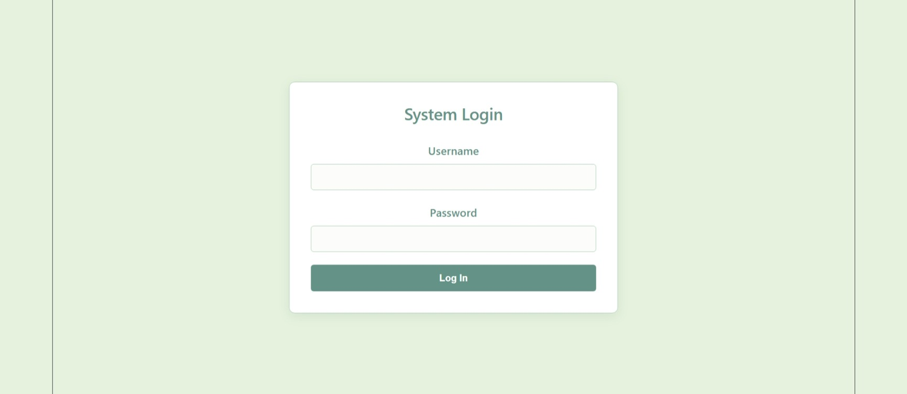
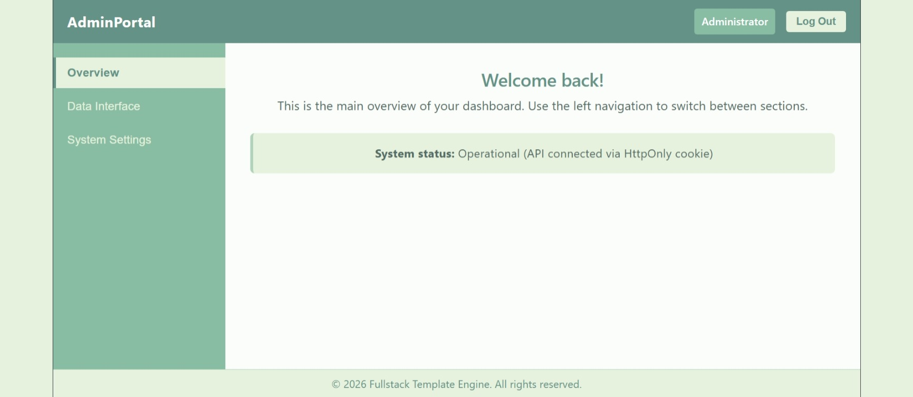

# Vue + Django JWT Auth Template


A minimal, production-minded full-stack authentication template combining a **Vue 3 (Composition API + Pinia)** frontend with a **Django REST Framework** backend, using **JWT access tokens with HttpOnly-cookie refresh token rotation** and simple role-based (admin/user) access control.

This project was built as a learning exercise and portfolio reference for a secure, modern JWT auth flow — not a full application, but a solid, reusable starting point.

## Screenshots

| Login | Admin Dashboard | User Dashboard |
|---|---|---|
|  |  |  |

## Features

- **Access token in memory, refresh token in an HttpOnly cookie**
  The access token never touches `localStorage` or `sessionStorage`, which keeps it out of reach of XSS attacks. The refresh token lives in an `HttpOnly`, `SameSite=Lax` cookie, so it's invisible to JavaScript entirely.
- **Silent refresh**
  On app load, the frontend transparently tries to restore a session via the refresh cookie — no visible flicker, no forced re-login.
- **Automatic token renewal on 401**
  An Axios response interceptor catches expired access tokens, refreshes them in the background, and retries the original request once.
- **Refresh token rotation + blacklisting**
  Every refresh issues a new refresh token and blacklists the old one (`rest_framework_simplejwt.token_blacklist`), limiting the blast radius of a leaked token.
- **Role-based UI**
  A minimal `isAdmin` flag drives a themed dashboard with an admin-only settings tab.

## Tech Stack

| Layer     | Tech                                                              |
|-----------|--------------------------------------------------------------------|
| Frontend  | Vue 3, Vite, Pinia, Axios                                          |
| Backend   | Django 4.2, Django REST Framework, `djangorestframework-simplejwt` |
| Auth      | JWT (access + refresh), HttpOnly cookie refresh flow               |

## Project Structure

```
frontend/
  index.html
  package.json
  vite.config.js
  .env.example
  src/
    assets/            # screenshots used in this README
    stores/auth.js     # Pinia store: token state, login/logout, silent refresh
    api.js             # Axios instance + interceptors (auth header, auto-refresh)
    main.js
    App.vue            # Login screen + role-based dashboard
backend/
  manage.py
  requirements.txt
  .env.example
  api/
    apps.py
    serializers.py     # adds the isAdmin flag to the login response
    views.py           # cookie-based token obtain/refresh, logout, protected endpoint
  mybackend/
    settings.py
    urls.py
    wsgi.py
```

## How the Auth Flow Works

1. **Login** — `POST /api/token/`
   The backend validates credentials, returns the **access token** in the JSON body, and sets the **refresh token** as an `HttpOnly` cookie (never exposed to JS). The user's role (`isAdmin`) is included in the response.
2. **Authenticated requests**
   The Axios request interceptor attaches `Authorization: Bearer <access_token>` to every call.
3. **Access token expires (15 min)** — a request comes back `401`.
   The response interceptor calls `POST /api/token/refresh/` with no body; the browser automatically sends the refresh cookie. The backend validates it, rotates it (issues + stores a new one, blacklists the old one), and returns a fresh access token. The original request is retried transparently.
4. **App reload** — `attemptSilentRefresh()` runs the same refresh call on mount, so a valid session survives a full page reload without the user noticing.
5. **Logout** — `POST /api/logout/`
   The backend clears the refresh cookie; the frontend clears in-memory state.

## Getting Started

### Backend

```bash
cd backend
python -m venv venv
source venv/bin/activate      # Windows: venv\Scripts\activate
pip install -r requirements.txt
cp .env.example .env          # adjust values if needed, defaults work out of the box
python manage.py migrate
python manage.py createsuperuser
python manage.py runserver
```

**Test accounts**

`createsuperuser` always creates a user with `is_staff=True`, which the frontend treats as the **Admin** role. To test the **User** dashboard, create a second, non-staff account:

```bash
python manage.py shell -c "from django.contrib.auth import get_user_model; get_user_model().objects.create_user(username='user1', password='ChangeMe123!')"
```

Alternatively, create one via `/admin/` (Django admin) and leave **"Staff status"** unchecked. Log in with that account's credentials in the frontend to land on the regular User dashboard — the same login form routes to either dashboard automatically based on the `isAdmin` flag returned by the backend.

Environment variables live in `backend/.env.example` — copy it to `.env` and adjust as needed (defaults work for local dev out of the box):

| Variable                       | Default                        | Purpose                          |
|--------------------------------|---------------------------------|-----------------------------------|
| `DJANGO_SECRET_KEY`            | placeholder, change it          | Django secret key                 |
| `DJANGO_DEBUG`                 | `True`                          | Debug mode                        |
| `DJANGO_ALLOWED_HOSTS`         | `localhost,127.0.0.1`           | Comma-separated allowed hosts     |
| `DJANGO_CORS_ALLOWED_ORIGINS`  | `http://localhost:5173`         | Comma-separated allowed origins   |

### Frontend

```bash
cd frontend
npm install
cp .env.example .env      # adjust VITE_API_BASE_URL if your backend runs elsewhere
npm run dev
```

## Using This as a Template

This repo is marked as a **GitHub template repository**, so starting a new project from it doesn't require cloning and manually stripping out git history:

1. On the repo page, click **"Use this template" → "Create a new repository"**.
2. Pick a name for your new project. GitHub gives you a fresh copy with no shared commit history — it's a new repo, not a fork, so future changes here won't leak into it and vice versa.
3. Rename the Django project package (`mybackend`) to match your project, if you want — search/replace `mybackend` in `manage.py`, `mybackend/settings.py`, and `mybackend/wsgi.py`.
4. Follow the **Getting Started** steps above.

Why a template repo instead of copy-pasting the folder each time: a plain copy drags along this project's git history (and its remote), so pushes can accidentally go to the wrong place, and there's no clear separation between "the template" and "a project built from it." A template repo gives every new project a clean, independent history from commit one, while this repo stays the single source of truth you improve over time.

## Notes on Security & Scope

- This is a **template**, not a hardened production system. Before deploying: set a real `DJANGO_SECRET_KEY`, turn `DEBUG` off, configure `ALLOWED_HOSTS`, and serve everything over HTTPS with `secure=True` cookies.
- The refresh endpoint currently trusts the cookie without a CSRF token. Since the response can't be read cross-origin (CORS blocks it) this is low-risk, but adding CSRF protection or `SameSite=Strict` is a reasonable hardening step if frontend and backend share a top-level domain.
- Login/refresh throttling is enabled via DRF's `AnonRateThrottle`/`UserRateThrottle` as a basic brute-force guard — tune the rates for your use case.

## License

MIT — feel free to use this as a starting point for your own projects.